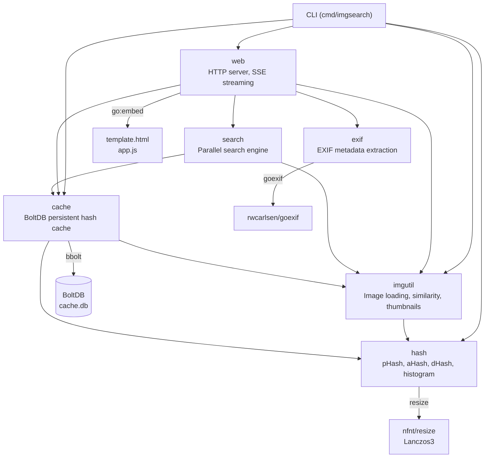
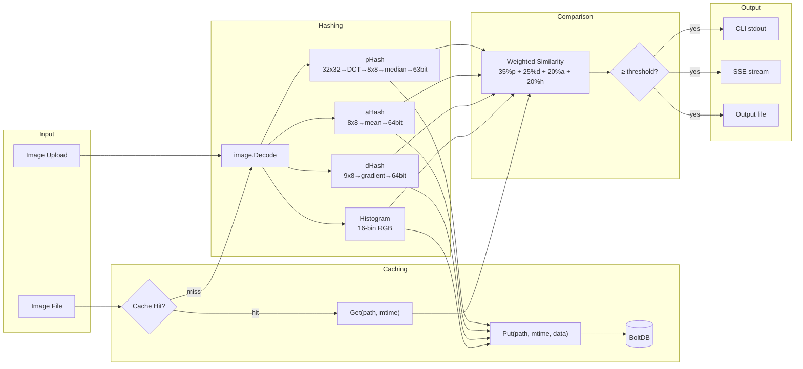
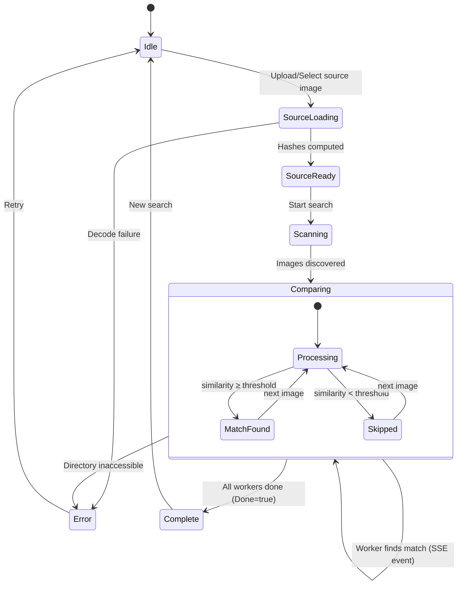

# Perceptual Image Search Requirements

## Introduction

ImgSearch is a fast, parallel image similarity search tool that finds visually similar images across large directory trees using perceptual hashing algorithms. It supports two interaction modes: a CLI for scripting and automation, and a web UI with real-time streaming results. The tool is designed for use cases such as finding duplicate photographs, locating modified copies of an image, and identifying visually related content across collections of thousands of images.

The core matching engine combines four complementary algorithms — perceptual hash (pHash), average hash (aHash), difference hash (dHash), and color histogram comparison — into a weighted similarity score. This multi-algorithm approach makes the system robust against common image transformations such as rescaling, recompression, cropping, and minor color adjustments. Results are streamed as they are found, allowing users to begin reviewing matches before the full directory scan completes.

Performance is a first-class concern. Image hashing is parallelized across all available CPU cores, and an optional BoltDB-based persistent cache eliminates redundant DCT computations on repeated searches. Cache entries are keyed by file path and modification time, ensuring stale entries are automatically invalidated when files change. The web UI uses Server-Sent Events (SSE) for real-time progress and result streaming.

Security is enforced through localhost-only binding by default, path traversal prevention on all file-access endpoints, HTTP header injection sanitization, and cryptographic search IDs. The system is containerized via a multi-stage Docker build running as a non-root user.

## Glossary

- **Perceptual_Hash (pHash)**: A 63-bit hash derived from the low-frequency DCT coefficients of a 32x32 grayscale representation of an image. Resistant to scaling and compression artifacts.
- **Average_Hash (aHash)**: A 64-bit hash where each bit indicates whether a pixel in an 8x8 grayscale thumbnail exceeds the mean brightness. Simple and fast.
- **Difference_Hash (dHash)**: A 64-bit hash based on horizontal gradient direction between adjacent pixels in a 9x8 grayscale thumbnail. Resistant to scaling and aspect ratio changes.
- **Color_Histogram**: A normalized 16-bin-per-channel RGB distribution used for color-based similarity comparison.
- **Hamming_Distance**: The number of differing bits between two binary hashes. Lower distance means higher similarity.
- **Similarity_Score**: A 0–100% composite metric computed as 35% pHash + 25% dHash + 20% aHash + 20% histogram similarity.
- **Threshold**: The minimum Similarity_Score required for an image to be included in results. Default is 70%.
- **DCT (Discrete_Cosine_Transform)**: A frequency-domain transform applied to a 32x32 grayscale image; the top-left 8x8 low-frequency coefficients (excluding DC) form the pHash.
- **SSE (Server-Sent_Events)**: A unidirectional HTTP streaming protocol used by the web UI to receive real-time search results and progress updates from the server.
- **BoltDB_Cache**: An embedded key/value database (bbolt) that persistently stores precomputed hash data keyed by `path\x00mtime_nanoseconds`.
- **Search_ID**: A cryptographically random 128-bit hex identifier used to correlate a search request with its SSE result stream.
- **Base_Path**: The root directory from which all file-access API endpoints are constrained. Defaults to the user's home directory.
- **Worker**: A goroutine that reads image paths from a shared channel, computes (or retrieves cached) hashes, and emits matching results.

## Requirements

### Requirement 1: Perceptual Hashing Algorithms

**User Story:** As a user, I want the system to compute multiple perceptual hashes for each image, so that similarity detection is robust against different types of image transformations.

#### Acceptance Criteria

1. THE hash.Perceptual function SHALL resize the input image to 32x32 using Lanczos3 interpolation, convert to grayscale using luminosity coefficients (0.299R + 0.587G + 0.114B), compute a 2D DCT, extract the top-left 8x8 coefficients excluding the DC component, compute the median of those 63 values, and return a 63-bit hash where each bit is 1 if the coefficient exceeds the median.
2. THE hash.Average function SHALL resize the input image to 8x8 using Lanczos3, convert to grayscale, compute the mean brightness, and return a 64-bit hash where each bit is 1 if the corresponding pixel exceeds the mean.
3. THE hash.Difference function SHALL resize the input image to 9x8 using Lanczos3, convert to grayscale, and return a 64-bit hash where each bit is 1 if a pixel's brightness is less than its right neighbor.
4. THE hash.ComputeColorHistogram function SHALL compute a 16-bin normalized histogram for each of the R, G, and B channels, skipping fully transparent pixels.
5. THE hash.HammingDistance function SHALL return the count of differing bits between two uint64 hashes.
6. THE hash.Similarity function SHALL convert a Hamming distance to a percentage via `100 * (1 - distance/hashBits)`.
7. THE hash.HistogramSimilarity function SHALL compute similarity between two histograms as the sum of per-bin minimums across all three channels, normalized to 0–100%.

### Requirement 2: Composite Similarity Scoring

**User Story:** As a user, I want a single similarity score that combines multiple algorithms, so that I get more reliable results than any single algorithm provides.

#### Acceptance Criteria

1. THE imgutil.ComputeSimilarity function SHALL compute a weighted average of four sub-scores: 35% pHash similarity (63-bit), 25% dHash similarity (64-bit), 20% aHash similarity (64-bit), and 20% histogram similarity.
2. THE System SHALL return a score in the range 0.0–100.0 for every image pair comparison.

### Requirement 3: Image Discovery and Filtering

**User Story:** As a user, I want the system to recursively scan directories for supported images, so that I can search large nested photo libraries.

#### Acceptance Criteria

1. THE imgutil.FindImages function SHALL recursively walk the specified directory tree and return paths to all files with `.jpg` or `.jpeg` extensions (case-insensitive).
2. WHEN a file or directory is inaccessible during the walk, THE System SHALL log a warning to stderr and continue scanning remaining entries.
3. THE imgutil.IsImageFile function SHALL return true only for files with `.jpg` or `.jpeg` extensions (case-insensitive).

### Requirement 4: Parallel Search Engine

**User Story:** As a user, I want image comparisons to run in parallel across all CPU cores, so that large directories are searched quickly.

#### Acceptance Criteria

1. WHEN workers is set to 0, THE search.Run function SHALL default the worker count to `runtime.NumCPU()`.
2. THE search.Run function SHALL distribute image paths to workers via a buffered channel and process them concurrently.
3. WHEN a worker finds an image with similarity >= threshold, THE System SHALL invoke the callback with a Result containing the match, a 200px thumbnail, total image count, and current scanned count.
4. WHEN all images have been processed, THE System SHALL invoke the callback with a Result where Done is true and Scanned equals Total.
5. WHEN the search directory contains no images, THE System SHALL invoke the callback with Done=true, Total=0, Scanned=0 immediately.

### Requirement 5: CLI Mode

**User Story:** As a user, I want to run image searches from the command line, so that I can automate searches via scripts and pipelines.

#### Acceptance Criteria

1. THE CLI SHALL require the `-source` flag specifying the source image file when not in web mode.
2. THE CLI SHALL support the following flags: `-dir` (default `.`), `-threshold` (default 70.0), `-workers` (default 0), `-top` (default 0), `-verbose` (default false), `-output` (default empty), `-cache-path` (default empty), `-no-cache` (default false).
3. THE CLI SHALL print each match to stdout as it is found, in the format `N. [X.Y%] path`.
4. WHEN `-output` is specified, THE CLI SHALL write all matches sorted by descending similarity to the specified file after all workers complete.
5. WHEN `-top N` is specified with N > 0, THE CLI SHALL limit the output file to the top N results.
6. WHEN `-verbose` is true, THE CLI SHALL print pHash hex values and Hamming distances for each match.
7. THE CLI SHALL exclude the source image from search results by comparing absolute paths.

### Requirement 6: Web Server and API

**User Story:** As a user, I want a web-based interface to upload images and browse results interactively, so that I can use the tool without command-line knowledge.

#### Acceptance Criteria

1. THE Server SHALL serve embedded HTML and JavaScript at `GET /` and `GET /app.js` respectively.
2. THE `POST /api/search` endpoint SHALL accept a multipart form with an `image` file and optional `threshold`, `workers`, `topN`, and `dir` fields, validate the search directory against the allowed base path, and return a JSON response containing a `searchId`.
3. THE `GET /api/results/{searchId}` endpoint SHALL stream results as SSE events, where each event is a JSON-encoded search.Result, and clean up the search channel after the stream completes.
4. THE `GET /api/thumbnail?path=` endpoint SHALL validate the path, generate a 200px max-dimension JPEG thumbnail, and return it with `Content-Type: image/jpeg`.
5. THE `GET /api/browse?path=` endpoint SHALL validate the path, list non-hidden directory entries sorted directories-first then alphabetically (case-insensitive), and return a JSON BrowseResponse. WHEN path is empty, THE System SHALL default to the allowed base path or user home directory.
6. THE `GET /api/exif?path=` endpoint SHALL validate the path and return JSON-encoded EXIF metadata including camera make/model, datetime, dimensions, file size, orientation, aperture, shutter speed, ISO, focal length, lens model, software, and GPS coordinates.
7. THE `GET /api/download?path=` endpoint SHALL validate the path, verify it is an image file, sanitize the filename for the Content-Disposition header, and stream the file as an attachment.
8. THE `GET /api/cache/stats` endpoint SHALL return a JSON CacheStatsResponse with enabled status, hit/miss counts, hit rate percentage, entry count, and size in bytes and megabytes.
9. THE `GET|POST /api/cache/scan?dir=` endpoint SHALL validate the directory path and stream SSE progress events as the cache is populated for all images in the directory.
10. THE `POST /api/cache/clear` endpoint SHALL remove all cache entries and return a JSON success/error response.
11. THE `GET /api/cache/directories` endpoint SHALL return a JSON list of cached directories with image counts, truncated to a maximum depth of 4 path levels.

### Requirement 7: Hash Caching

**User Story:** As a user, I want computed hashes to be cached persistently, so that repeated searches against the same directory are dramatically faster.

#### Acceptance Criteria

1. THE cache.BoltCache SHALL store hash data in a BoltDB database with keys in the format `path\x00mtime_nanoseconds`.
2. THE cache.Get function SHALL return cached hash data only when the path and modification time match exactly; otherwise it SHALL return a cache miss.
3. THE cache.Put function SHALL not store entries where data is nil or data.Error is non-nil.
4. THE cache.Clear function SHALL delete and recreate the hashes bucket atomically.
5. THE cache.Stats function SHALL return thread-safe hit/miss counters, entry count from the BoltDB bucket, and database file size from the filesystem.
6. THE cache.Scan function SHALL walk a directory, skip already-cached images, compute and cache hashes for uncached images, and invoke the progress callback after each image.
7. THE cache.DefaultPath function SHALL return `~/.imgsearch/cache.db`.
8. THE cache.ListDirectories function SHALL enumerate all cached entries, extract directory paths from keys, truncate paths to 4 levels maximum depth, and return aggregated counts sorted alphabetically.
9. WHEN `-cache-path` is provided and `-no-cache` is false, THE System SHALL open a BoltCache at the specified path with a 5-second timeout and 0600 permissions.
10. WHEN `-no-cache` is true, THE System SHALL not open or use a cache regardless of `-cache-path`.

### Requirement 8: Security

**User Story:** As a user, I want the web server to be secure by default, so that my filesystem is not exposed to unauthorized access.

#### Acceptance Criteria

1. THE Server SHALL bind to `127.0.0.1` by default. WHEN `-bind 0.0.0.0` is specified, THE Server SHALL print a warning about network accessibility.
2. THE Server.validatePath function SHALL resolve paths to absolute form, verify they fall within the allowed base path (default: user home directory), and reject paths outside this boundary including prefix attacks (e.g., `/home/user2` against base `/home/user`).
3. THE Server SHALL validate paths on every file-access endpoint: `/api/search`, `/api/thumbnail`, `/api/browse`, `/api/exif`, `/api/download`, `/api/cache/scan`.
4. THE sanitizeFilename function SHALL replace `"`, `\`, `\r`, `\n`, and null bytes with underscores to prevent HTTP header injection.
5. THE generateSearchID function SHALL use `crypto/rand` to produce 128-bit (32 hex character) search identifiers.
6. THE SSE endpoints SHALL not set `Access-Control-Allow-Origin` headers, restricting access to same-origin requests only.
7. THE Docker image SHALL run as a non-root user (`imgsearch`).

### Requirement 9: Image Loading and Thumbnailing

**User Story:** As a user, I want to upload images via the web UI and see thumbnail previews of results, so that I can visually verify matches.

#### Acceptance Criteria

1. THE imgutil.LoadAndHash function SHALL open a file by path, decode it (supporting JPEG, PNG, and GIF via registered decoders), compute all four hashes, and return them in a hash.Data struct.
2. THE imgutil.LoadAndHashFromReader function SHALL decode an image from an io.Reader and compute all four hashes, returning hash.Data and any error.
3. THE imgutil.GenerateThumbnail function SHALL resize the image to fit within the specified max dimension (maintaining aspect ratio) and return a base64-encoded JPEG at quality 80.
4. THE `POST /api/search` endpoint SHALL accept uploads up to 32MB.

### Requirement 10: EXIF Metadata Extraction

**User Story:** As a user, I want to view EXIF metadata for search results, so that I can identify images by camera, date, and location.

#### Acceptance Criteria

1. THE exif.Extract function SHALL read file size, image dimensions (via image.DecodeConfig), and EXIF tags from the specified file path.
2. THE exif.Extract function SHALL extract the following fields when present: Make, Model, DateTime, Orientation (mapped to human-readable names), FNumber (formatted as "f/X.X"), ExposureTime (formatted as "1/N s" or "X.X s"), ISO (formatted as "ISO N"), FocalLength (formatted as "N mm"), LensModel, Software, GPS latitude, and GPS longitude.
3. WHEN a file has no EXIF data, THE exif.Extract function SHALL return a Data struct with the Error field set to "No EXIF data" and any dimensions/file size still populated.

### Requirement 11: Web UI Features

**User Story:** As a user, I want an interactive web interface with drag-and-drop upload, directory browsing, real-time progress, and configurable search parameters.

#### Acceptance Criteria

1. THE web UI SHALL provide a drag-and-drop area for uploading source images.
2. THE web UI SHALL provide a filesystem browser modal for selecting the search directory.
3. THE web UI SHALL provide adjustable controls for similarity threshold, worker count, and maximum results.
4. THE web UI SHALL display a real-time progress bar with ETA during search.
5. THE web UI SHALL display result cards with thumbnails and similarity percentages as they arrive via SSE.
6. THE web UI SHALL provide an info button on each result card that lazy-loads and displays EXIF metadata on hover.
7. THE web UI SHALL provide a Settings tab with cache statistics, scan-to-cache functionality, and cache clear.
8. THE web UI assets (template.html, app.js) SHALL be embedded in the binary via `go:embed`.

### Requirement 12: Docker Support

**User Story:** As a user, I want to run ImgSearch in a Docker container, so that I can deploy it without installing Go or managing dependencies.

#### Acceptance Criteria

1. THE Dockerfile SHALL use a multi-stage build: golang:1.24-alpine for building, alpine:latest for runtime.
2. THE Dockerfile SHALL build with `CGO_ENABLED=0` and `-ldflags="-s -w"` for a static, stripped binary.
3. THE container SHALL default to web mode bound to `0.0.0.0` on port 9183.
4. THE container SHALL run as a non-root `imgsearch` user.

### Requirement 13: Build System

**User Story:** As a developer, I want standardized build and test commands, so that I can build, test, and cross-compile consistently.

#### Acceptance Criteria

1. THE Makefile SHALL support targets: `build`, `build-debug`, `build-all`, `install`, `clean`, `deps`, `test`, `test-race`, `coverage`, `run`, `help`.
2. THE `build-all` target SHALL cross-compile for linux/amd64, linux/arm64, darwin/amd64, darwin/arm64, and windows/amd64.
3. THE `coverage` target SHALL generate an HTML coverage report.
4. THE `build` target SHALL strip symbols with `-ldflags="-s -w"`.

### Requirement 14: Test Infrastructure

**User Story:** As a developer, I want programmatic test image generation, so that tests are deterministic and the repository contains no binary fixtures.

#### Acceptance Criteria

1. THE testutil package SHALL provide functions to generate test images programmatically: SolidColorImage, GradientImage, CheckerboardImage, RedGreenImage.
2. THE testutil package SHALL provide JPEG encoding helpers: EncodeJPEG, EncodeJPEGWithQuality.
3. THE testutil package SHALL provide error-case helpers: CorruptedJPEG, EmptyBytes, NotAnImage.
4. THE testutil package SHALL provide temp file/directory helpers: CreateTempJPEG, CreateTempDir, CreateTempDirWithSubdirs.
5. THE repository SHALL contain no binary test fixtures.

## Diagrams

### Component Diagram

### Data Flow

### State Machine: Search Lifecycle

## Constraints

- **Go 1.23+** with toolchain 1.24.11; no CGo required for production builds.
- **Three external dependencies only**: `github.com/nfnt/resize` (image resizing), `github.com/rwcarlsen/goexif/exif` (EXIF extraction), `go.etcd.io/bbolt` (persistent cache). Do not introduce additional dependencies.
- **JPEG-only indexing**: `IsImageFile()` filters to `.jpg`/`.jpeg` only. The image decoder supports PNG and GIF via blank imports, but directory scanning does not index them.
- **Embedded web assets**: `template.html` and `app.js` must be embedded via `go:embed`; no external static file serving.
- **No authentication**: The web UI has no auth. Security relies on localhost binding and path traversal prevention.
- **Single-process architecture**: No external services, message queues, or databases beyond the embedded BoltDB cache.
- **Default port 9183**: The web UI listens on port 9183 by default.
- **Similarity weights are fixed**: 35% pHash, 25% dHash, 20% aHash, 20% histogram. Not user-configurable.
- **Thumbnail size fixed at 200px**: Max dimension for generated thumbnails.
- **Upload limit 32MB**: Maximum multipart form size for image uploads.
- **Cache key format**: `path\x00mtime_nanoseconds` — null byte separated, modification time in nanoseconds.
- **No test binary fixtures**: All test images must be generated programmatically via `internal/testutil`.

## Correctness Properties

### Property 1: Hash Determinism

*For any* valid image decoded to the same `image.Image` value, computing pHash, aHash, dHash, and color histogram SHALL produce identical output on every invocation.
**Validates: Requirements 1.1, 1.2, 1.3, 1.4**

### Property 2: Similarity Symmetry

*For any* two images A and B with precomputed hash data, `ComputeSimilarity(A, B)` SHALL equal `ComputeSimilarity(B, A)`.
**Validates: Requirements 2.1, 1.5, 1.6, 1.7**

### Property 3: Similarity Bounds

*For any* two images A and B, the composite similarity score SHALL be in the range [0.0, 100.0], and comparing an image to itself SHALL yield a score of 100.0.
**Validates: Requirements 2.1, 2.2**

### Property 4: Cache Coherence

*For any* file path and modification time pair, if `Put(path, mtime, data)` succeeds, then `Get(path, mtime)` SHALL return data equivalent to the stored data. If the file is modified (different mtime), `Get(path, oldMtime)` SHALL return a cache miss.
**Validates: Requirements 7.1, 7.2, 7.3**

### Property 5: Path Traversal Prevention

*For any* string `p` where the resolved absolute path of `p` does not have the allowed base path as a prefix (with separator boundary check), `validatePath(p)` SHALL return false. This includes paths containing `..`, symlink escapes, and prefix attacks (e.g., `/home/user2` against base `/home/user`).
**Validates: Requirements 8.2, 8.3**

### Property 6: Search Completeness

*For any* directory containing N image files, a search with threshold=0 SHALL invoke the result callback for every image whose similarity score is ≥ 0 (i.e., all N images), and the final callback SHALL have Done=true with Scanned=N and Total=N.
**Validates: Requirements 4.2, 4.3, 4.4, 4.5**

### Property 7: Hamming Distance Triangle Inequality

*For any* three hashes A, B, C, `HammingDistance(A, C) <= HammingDistance(A, B) + HammingDistance(B, C)`, since Hamming distance is a metric.
**Validates: Requirements 1.5, 1.6**

### Property 8: File Discovery Completeness

*For any* directory tree, `FindImages(root)` SHALL return exactly the set of files under `root` (recursive) whose extensions match `.jpg` or `.jpeg` (case-insensitive), excluding inaccessible paths which are logged but skipped.
**Validates: Requirements 3.1, 3.2, 3.3**

## Out of Scope

- **Non-JPEG format indexing**: PNG, GIF, WebP, TIFF, HEIC, and RAW formats are not indexed by the directory scanner despite decoder support.
- **Authentication and authorization**: No user login, API keys, tokens, or access control beyond localhost binding.
- **HTTPS/TLS termination**: The server runs plain HTTP; TLS must be provided by a reverse proxy.
- **Rate limiting**: No per-IP or global request throttling.
- **Request timeouts**: No HTTP server read/write/idle timeouts configured.
- **Distributed search**: No multi-node or networked search; single-process only.
- **Image preprocessing**: No automatic rotation based on EXIF orientation, color correction, or watermark removal before hashing.
- **Configurable similarity weights**: The 35/25/20/20 weight distribution is hardcoded and not user-adjustable.
- **Database migrations**: No schema versioning or migration support for the BoltDB cache.
- **Result persistence**: Search results are ephemeral; no history or saved searches.
- **Batch/queue search**: No support for queuing multiple searches or batch processing.
- **File signature validation**: No magic byte verification before processing uploads.
- **Content-Security-Policy headers**: No CSP or other security headers beyond what is implemented.
- **Internationalization**: No i18n/l10n support; English only.
- **Mobile-responsive web UI**: No specific mobile optimization.
- **GPU acceleration**: DCT and hash computations are CPU-only.
